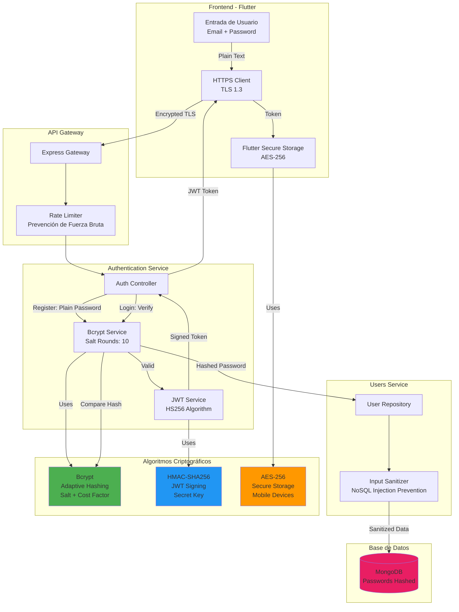

# Diagrama: Arquitectura de Criptografía en Planty



## Primitivas Criptográficas Utilizadas

### 1. Bcrypt (Hashing de Contraseñas)
```typescript
// Configuración
Salt Rounds: 10
Algoritmo: Blowfish-based
Tiempo de hash: ~100-200ms
```

**Ventajas**:
- Adaptativo (incrementa dificultad con el tiempo)
- Salt automático único por contraseña
- Resistente a rainbow tables
- Resistente a ataques GPU

### 2. HMAC-SHA256 (Firma JWT)
```typescript
// Configuración
Algoritmo: HS256
Secret: Almacenado en variable de entorno
Expiración: 24 horas
Payload: { userId, email, iat, exp }
```

**Ventajas**:
- Firma criptográfica verificable
- Previene manipulación de tokens
- Estándar de la industria (RFC 7519)

### 3. AES-256 (Almacenamiento Móvil)
```dart
// Configuración Flutter Secure Storage
Algoritmo: AES-256-CBC (Android)
Algoritmo: AES-256-GCM (iOS)
Key Storage: KeyStore/Keychain
```

**Ventajas**:
- Encriptación simétrica de alto nivel
- Protección hardware-backed
- No exportable mediante backup

## Políticas de Seguridad

❌ **Prohibido**:
- Algoritmos criptográficos personalizados
- MD5, SHA1 para passwords
- Almacenamiento de contraseñas en texto plano
- Secrets en código fuente

✅ **Requerido**:
- Usar librerías estándar y auditadas
- Rotación de secrets periódica
- Validación de entrada antes de hashing
- Logs sin datos sensibles
