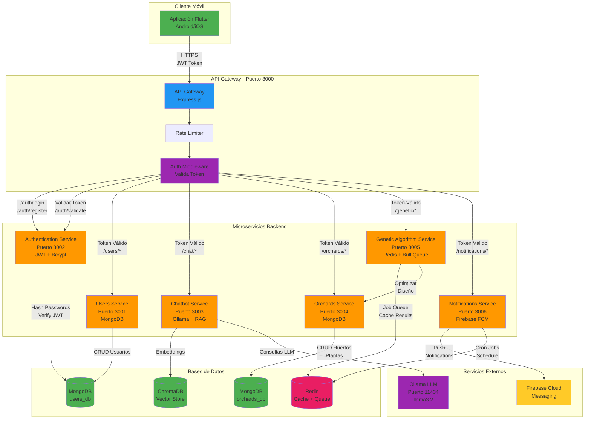

# Diagrama: Arquitectura General del Sistema Planty

## Descripción

Este diagrama muestra la arquitectura completa del sistema Planty, incluyendo:

- **Frontend**: Aplicación móvil Flutter para Android/iOS
- **API Gateway**: Punto de entrada único con rate limiting y autenticación
- **Microservicios (7 total)**:
  - Authentication Service (JWT, Bcrypt)
  - Users Service (CRUD usuarios)
  - Chatbot Service (Ollama + RAG)
  - Orchards Service (Gestión de huertos y plantas)
  - Genetic Algorithm Service (Optimización de diseños)
  - Notifications Service (Push notifications)
- **Bases de datos**:
  - MongoDB (users_db, orchards_db)
  - ChromaDB (vectores para RAG)
  - Redis (cache + job queue)
- **Servicios Externos**:
  - Ollama LLM (procesamiento de lenguaje natural)
  - Firebase Cloud Messaging (notificaciones push)

## Flujo de Autenticación y Autorización

1. **Login/Register** (`/auth/login`, `/auth/register`):
   - Cliente envía credenciales al API Gateway
   - Gateway aplica rate limiting (5 req/15min)
   - Se enruta directamente a Authentication Service
   - Authentication Service valida credenciales y genera JWT
   - Token JWT se devuelve en header `Authorization`

2. **Validación de Token** (`/auth/validate`):
   - Auth Middleware intercepta requests protegidos
   - Extrae token del header `Authorization: Bearer <token>`
   - Llama a Authentication Service en `/auth/validate`
   - Authentication Service verifica firma y expiración
   - Si es válido, permite acceso al microservicio solicitado

3. **Acceso a Recursos Protegidos**:
   - Todos los endpoints excepto `/auth/login` y `/auth/register` requieren token
   - Auth Middleware valida token antes de rutear
   - Servicios protegidos: Users, Chatbot, Orchards, Genetic Algorithm, Notifications

## Flujo de Datos

### Chatbot
1. Cliente envía mensaje con token JWT
2. Gateway valida token con Authentication Service
3. Chatbot Service genera embeddings del mensaje
4. Consulta ChromaDB para contexto relevante (RAG)
5. Envía prompt a Ollama LLM
6. Retorna respuesta al cliente

### Huertos (Orchards)
1. Cliente crea/consulta huerto con token JWT
2. Gateway valida token
3. Orchards Service procesa CRUD en MongoDB (orchards_db)
4. Puede notificar eventos vía Notifications Service

### Algoritmo Genético
1. Cliente solicita diseño optimizado de huerto
2. Gateway valida token
3. Genetic Algorithm Service crea job en Redis Queue
4. Consulta datos de huerto desde Orchards Service
5. Ejecuta algoritmo genético de optimización
6. Guarda resultado en cache (Redis)
7. Retorna diseño optimizado

### Notificaciones
1. Cron jobs ejecutan tareas programadas
2. Notifications Service consulta datos de usuarios/huertos
3. Envía notificaciones push vía Firebase FCM
4. Notificaciones: riego, cosecha, plagas, etc.

## Puertos de Servicios

| Servicio | Puerto | Base de Datos |
|----------|--------|---------------|
| API Gateway | 3000 | N/A |
| Authentication | 3002 | MongoDB (users_db) |
| Users | 3001 | MongoDB (users_db) |
| Chatbot | 3003 | ChromaDB |
| Orchards | 3004 | MongoDB (orchards_db) |
| Genetic Algorithm | 3005 | Redis |
| Notifications | 3006 | Firebase + Redis |
| Ollama LLM | 11434 | N/A |
