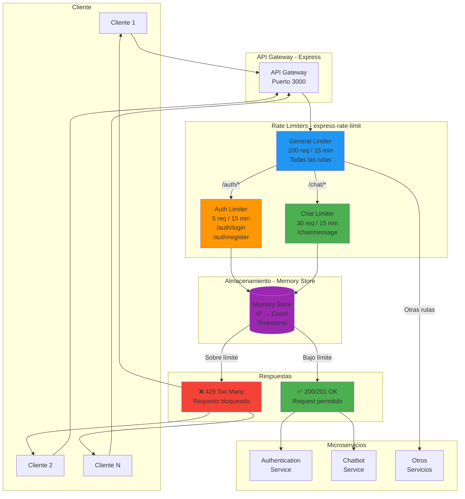
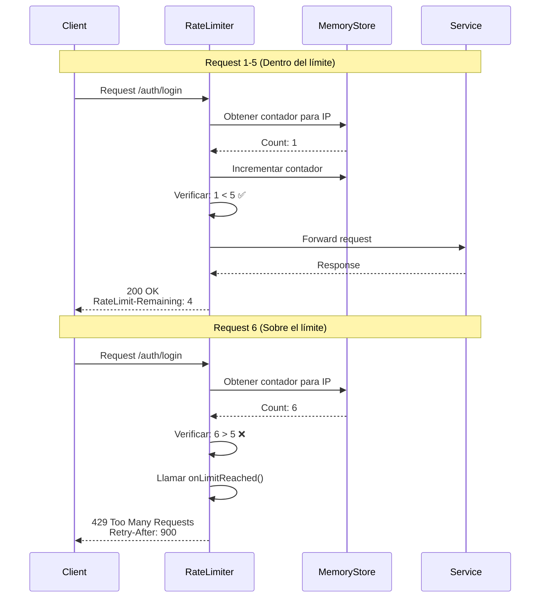

# Diagrama: Arquitectura de Rate Limiting por Endpoint



## Configuración de Rate Limiters

### 1. General Limiter (Todas las rutas)
```typescript
// Archivo: api-gateway/src/middleware/rateLimiters.ts
import rateLimit from 'express-rate-limit';

export const generalLimiter = rateLimit({
  windowMs: 15 * 60 * 1000,  // 15 minutos
  max: 100,                   // 100 requests por ventana
  message: 'Demasiadas solicitudes, intenta de nuevo mas tarde',
  standardHeaders: true,      // Return rate limit info in `RateLimit-*` headers
  legacyHeaders: false,       // Disable `X-RateLimit-*` headers

  // Identificador único por cliente
  keyGenerator: (req) => {
    return req.ip || req.socket.remoteAddress;
  },

  // Handler personalizado
  handler: (req, res) => {
    res.status(429).json({
      error: 'Demasiadas solicitudes',
      retryAfter: Math.ceil(req.rateLimit.resetTime.getTime() / 1000)
    });
  }
});
```

### 2. Auth Limiter (Login/Register)
```typescript
export const authLimiter = rateLimit({
  windowMs: 15 * 60 * 1000,  // 15 minutos
  max: 5,                     // 5 intentos por ventana
  message: 'Demasiados intentos de autenticacion',
  skipSuccessfulRequests: false,
  skipFailedRequests: false,

  // Logging de intentos sospechosos
  onLimitReached: (req, res, options) => {
    console.warn(`🚨 Rate limit alcanzado: ${req.ip} en ${req.path}`);
    // TODO: Enviar alerta o guardar en log de seguridad
  }
});
```

### 3. Chat Limiter (Mensajes de chatbot)
```typescript
export const chatLimiter = rateLimit({
  windowMs: 15 * 60 * 1000,  // 15 minutos
  max: 30,                    // 30 mensajes por ventana
  message: 'Demasiados mensajes enviados',

  // Rate limit por usuario autenticado (no solo por IP)
  keyGenerator: (req) => {
    return req.user?.id || req.ip;
  }
});
```

## Aplicación de Limiters

### En Rutas de Express
```typescript
// Archivo: api-gateway/src/routes/index.ts
import express from 'express';
import { generalLimiter, authLimiter, chatLimiter } from '../middleware/rateLimiters';

const app = express();

// Aplicar limiter general a todas las rutas
app.use(generalLimiter);

// Aplicar limiter específico a rutas de autenticación
app.use('/api/auth/login', authLimiter);
app.use('/api/auth/register', authLimiter);

// Aplicar limiter específico a rutas de chat
app.use('/api/chat', chatLimiter);
```

## Flujo de Funcionamiento



## Headers de Rate Limit

Respuesta típica con headers:
```http
HTTP/1.1 200 OK
RateLimit-Limit: 5
RateLimit-Remaining: 2
RateLimit-Reset: 1640086400
Retry-After: 900
```

Cuando se excede el límite:
```http
HTTP/1.1 429 Too Many Requests
RateLimit-Limit: 5
RateLimit-Remaining: 0
RateLimit-Reset: 1640086400
Retry-After: 900
Content-Type: application/json

{
  "error": "Demasiados intentos de autenticacion",
  "retryAfter": 900
}
```

## Configuración por Endpoint

| Endpoint | Límite | Ventana | Razón |
|----------|--------|---------|-------|
| `/*` | 100 req | 15 min | Protección general |
| `/auth/login` | 5 req | 15 min | Prevenir fuerza bruta |
| `/auth/register` | 5 req | 15 min | Prevenir registro masivo |
| `/chat/message` | 30 req | 15 min | Evitar spam al LLM |
| `/users/*` | 50 req | 15 min | CRUD normal de usuarios |

## Estrategias de Rate Limiting

### Por IP (Default)
```typescript
keyGenerator: (req) => req.ip
```
- ✅ Fácil de implementar
- ❌ Vulnerable a IP spoofing
- ❌ Afecta a usuarios detrás de NAT

### Por Usuario Autenticado
```typescript
keyGenerator: (req) => req.user?.id || req.ip
```
- ✅ Más preciso
- ✅ No afecta a usuarios legítimos
- ⚠️ Requiere autenticación previa

### Por Combinación
```typescript
keyGenerator: (req) => `${req.ip}:${req.user?.id || 'anonymous'}`
```
- ✅ Balance entre precisión y seguridad
- ✅ Protege contra múltiples vectores

## Almacenamiento de Contadores

### Memory Store (Actual)
```typescript
// En memoria del proceso Node.js
// ✅ Rápido
// ❌ Se pierde al reiniciar
// ❌ No funciona con múltiples instancias
```

### Redis Store (Futuro - Recomendado)
```typescript
import RedisStore from 'rate-limit-redis';
import Redis from 'ioredis';

const redis = new Redis({
  host: 'localhost',
  port: 6379
});

const authLimiter = rateLimit({
  store: new RedisStore({
    client: redis,
    prefix: 'rl:auth:'
  }),
  windowMs: 15 * 60 * 1000,
  max: 5
});
```
- ✅ Persistente
- ✅ Compartido entre instancias
- ✅ Escalable

## Monitoreo y Alertas

### Logging de Rate Limit Events
```typescript
onLimitReached: (req, res, options) => {
  const logEntry = {
    timestamp: new Date().toISOString(),
    ip: req.ip,
    path: req.path,
    method: req.method,
    user: req.user?.id,
    count: req.rateLimit.current
  };

  console.warn('🚨 Rate limit exceeded:', logEntry);

  // Enviar a sistema de alertas
  // sendAlert('rate-limit-exceeded', logEntry);
}
```

### Métricas
- Número de requests bloqueados por endpoint
- IPs más bloqueadas
- Patrones de ataque detectados
- Tasa de false positives
