# Diagrama: Estructura de Directorios del Proyecto Planty

```mermaid
graph TB
    subgraph "ApiGateway - Proyecto Raíz"
        Root[ApiGateway/]
    end

    subgraph "API Gateway - Puerto 3000"
        GW[api-gateway/]
        GWSrc[src/]
        GWMiddleware[middleware/]
        GWRoutes[routes/]
        GWConfig[config/]
    end

    subgraph "Authentication Service - Puerto 3002"
        Auth[authentication/]
        AuthSrc[src/]
        AuthDomain[domain/]
        AuthApp[application/]
        AuthInfra[infrastructure/]
        AuthPres[presentation/]
    end

    subgraph "Users Service - Puerto 3001"
        Users[api-users/]
        UsersSrc[src/]
        UsersDomain[domain/]
        UsersApp[application/]
        UsersInfra[infrastructure/]
        UsersPres[presentation/]
    end

    subgraph "Chatbot Service - Puerto 3003"
        Chat[api-chatbot/]
        ChatSrc[src/]
        ChatDomain[domain/]
        ChatApp[application/]
        ChatInfra[infrastructure/]
        ChatPres[presentation/]
    end

    subgraph "Flutter Mobile App"
        Flutter[Planty/]
        Lib[lib/]
        Core[core/]
        Features[features/]
        Shared[shared/]
        Android[android/]
        iOS[ios/]
    end

    subgraph "Features - Hexagonal Architecture"
        AuthFeature[auth/<br/>- domain<br/>- data<br/>- presentation]
        HomeFeature[home/<br/>- domain<br/>- data<br/>- presentation]
        ChatFeature[chatbot/<br/>- domain<br/>- data<br/>- presentation]
    end

    subgraph "Core - Shared Infrastructure"
        DI[di/<br/>Dependency Injection]
        Router[router/<br/>Navigation]
        Network[network/<br/>HTTP Client]
        ErrorH[error/<br/>Error Handling]
    end

    subgraph "Docker & Config"
        Docker[docker-compose.yml]
        Env[.env files]
        Diagrams[DIAGRAMAS/]
        Docs[Documentación LaTeX]
    end

    Root --> GW
    Root --> Auth
    Root --> Users
    Root --> Chat
    Root --> Flutter
    Root --> Docker
    Root --> Env
    Root --> Diagrams
    Root --> Docs

    GW --> GWSrc
    GWSrc --> GWMiddleware
    GWSrc --> GWRoutes
    GWSrc --> GWConfig

    Auth --> AuthSrc
    AuthSrc --> AuthDomain
    AuthSrc --> AuthApp
    AuthSrc --> AuthInfra
    AuthSrc --> AuthPres

    Users --> UsersSrc
    UsersSrc --> UsersDomain
    UsersSrc --> UsersApp
    UsersSrc --> UsersInfra
    UsersSrc --> UsersPres

    Chat --> ChatSrc
    ChatSrc --> ChatDomain
    ChatSrc --> ChatApp
    ChatSrc --> ChatInfra
    ChatSrc --> ChatPres

    Flutter --> Lib
    Lib --> Core
    Lib --> Features
    Lib --> Shared
    Flutter --> Android
    Flutter --> iOS

    Core --> DI
    Core --> Router
    Core --> Network
    Core --> ErrorH

    Features --> AuthFeature
    Features --> HomeFeature
    Features --> ChatFeature

    style Root fill:#E3F2FD
    style GW fill:#FFECB3
    style Auth fill:#FFECB3
    style Users fill:#FFECB3
    style Chat fill:#FFECB3
    style Flutter fill:#C8E6C9
    style AuthFeature fill:#F8BBD0
    style HomeFeature fill:#F8BBD0
    style ChatFeature fill:#F8BBD0
```



## Estructura Detallada

### Backend - Clean Architecture + DDD

```
authentication/
├── src/
│   ├── domain/                  # Entidades y lógica de negocio
│   │   ├── entities/
│   │   │   └── User.ts
│   │   └── repositories/
│   │       └── IUserRepository.ts
│   ├── application/             # Casos de uso
│   │   ├── usecases/
│   │   │   ├── LoginUseCase.ts
│   │   │   └── RegisterUseCase.ts
│   │   └── dtos/
│   │       └── AuthDTO.ts
│   ├── infrastructure/          # Implementaciones técnicas
│   │   ├── repositories/
│   │   │   └── MongoUserRepository.ts
│   │   ├── services/
│   │   │   ├── BcryptService.ts
│   │   │   └── JwtService.ts
│   │   └── database/
│   │       └── mongoose.config.ts
│   └── presentation/            # Controladores y rutas
│       ├── controllers/
│       │   └── AuthController.ts
│       ├── routes/
│       │   └── auth.routes.ts
│       └── middlewares/
│           └── validateToken.ts
├── package.json
├── tsconfig.json
└── .env
```

### Frontend - Hexagonal Architecture + MVVM

```
Planty/lib/
├── core/                        # Infraestructura compartida
│   ├── application/
│   │   └── auth_provider.dart
│   ├── di/
│   │   ├── injection.dart
│   │   └── service_locator.dart
│   ├── router/
│   │   ├── app_router.dart
│   │   ├── app_routes.dart
│   │   └── guards/
│   │       └── auth_guard.dart
│   ├── network/
│   │   └── http_client.dart
│   └── error/
│       ├── exception.dart
│       └── failure.dart
├── features/                    # Características por módulo
│   ├── auth/
│   │   ├── domain/             # Lógica de negocio
│   │   │   ├── entities/
│   │   │   │   └── user.dart
│   │   │   └── repositories/
│   │   │       └── auth_repository.dart
│   │   ├── data/               # Fuentes de datos
│   │   │   ├── datasource/
│   │   │   │   ├── user_service.dart
│   │   │   │   └── storage_service.dart
│   │   │   ├── models/
│   │   │   │   └── auth_response.dart
│   │   │   └── repositories/
│   │   │       └── user_repository_impl.dart
│   │   └── presentation/       # UI y estado
│   │       ├── pages/
│   │       │   ├── login_page.dart
│   │       │   └── register_page.dart
│   │       ├── providers/
│   │       │   ├── login_provider.dart
│   │       │   └── register_provider.dart
│   │       └── widgets/
│   │           └── auth_form.dart
│   ├── home/
│   │   └── [misma estructura]
│   └── chatbot/
│       └── [misma estructura]
└── shared/                      # Componentes reutilizables
    ├── widgets/
    │   ├── atoms/
    │   ├── molecules/
    │   └── organisms/
    ├── theme/
    │   └── app_theme.dart
    └── utils/
        └── validators.dart
```

## Patrones de Arquitectura

### Backend
- **Clean Architecture**: Separación por capas con dependencias hacia el interior
- **DDD**: Entidades ricas, repositorios, casos de uso
- **Dependency Injection**: Inversión de control para testability

### Frontend
- **Hexagonal Architecture**: Puertos y adaptadores, domain puro
- **MVVM**: Separación de vista, vista-modelo y modelo
- **Provider**: Gestión de estado reactiva
- **Atomic Design**: Componentes UI jerarquizados
