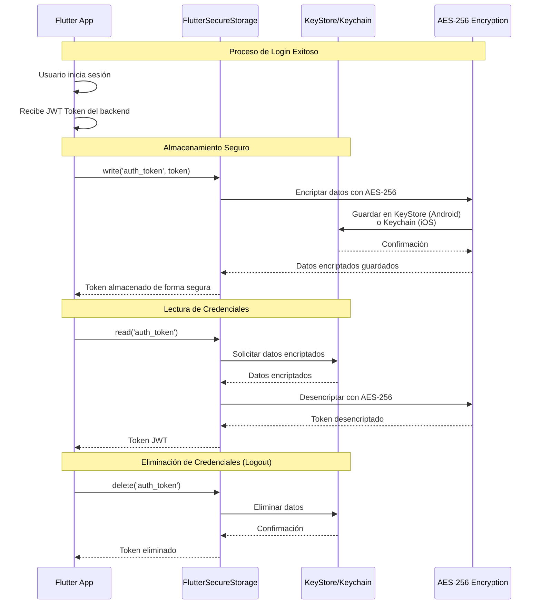

# Diagrama: Flujo de Almacenamiento Seguro de Credenciales

## Características de Seguridad

### Encriptación
- **Algoritmo**: AES-256 (Advanced Encryption Standard)
- **Modo**: CBC (Cipher Block Chaining)
- **Automático**: Flutter Secure Storage maneja la encriptación/desencriptación

### Almacenamiento Nativo

**Android (KeyStore)**:
- Hardware-backed encryption (si está disponible)
- Protegido por credenciales de desbloqueo del dispositivo
- No exportable mediante backup

**iOS (Keychain)**:
- Secure Enclave (A7+ chips)
- Protección mediante biometría o PIN
- Aislamiento en sandbox de la app

### Datos Almacenados
- ✅ Token JWT de autenticación
- ✅ Datos de sesión del usuario (JSON encriptado)
- ✅ Preferencias sensibles
- ❌ Contraseñas (nunca se almacenan)
