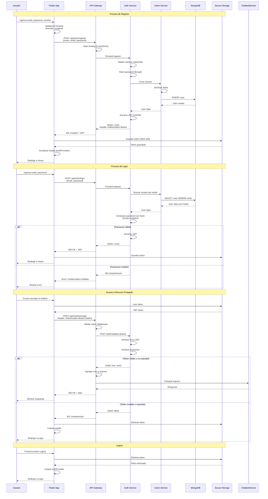

# Diagrama: Flujo de Autenticación con JWT



## Componentes del Sistema JWT

### Token JWT Estructura
```json
{
  "header": {
    "alg": "HS256",
    "typ": "JWT"
  },
  "payload": {
    "userId": "uuid-here",
    "email": "user@example.com",
    "iat": 1640000000,
    "exp": 1640086400
  },
  "signature": "HMAC-SHA256(base64(header).base64(payload), secret)"
}
```

### Validaciones Implementadas

**Frontend**:
- ✅ Formato de email válido
- ✅ Longitud mínima de contraseña (8 caracteres)
- ✅ Complejidad de contraseña (mayúsculas, minúsculas, números)

**Backend**:
- ✅ Campos requeridos presentes
- ✅ Sanitización de entrada
- ✅ Verificación de usuario existente
- ✅ Hash seguro de contraseña
- ✅ Firma criptográfica del token
- ✅ Expiración del token (24h)

### Estados de Autenticación

| Estado | Descripción | Acción |
|--------|-------------|--------|
| `unauthenticated` | Sin token válido | Mostrar login |
| `authenticated` | Token válido presente | Permitir acceso |
| `token_expired` | Token expirado | Renovar o logout |
| `token_invalid` | Token manipulado | Logout forzado |
