# Diagrama: Flujo de Pruebas de Autenticación y Autorización

```mermaid
flowchart TD
    Start([Inicio de Pruebas]) --> Test1[Prueba 1:<br/>Acceso sin token]

    Test1 --> Send1[Enviar POST /api/chat/message<br/>sin header Authorization]
    Send1 --> Check1{¿Respuesta<br/>401?}
    Check1 -->|Sí| Pass1[✅ PASS:<br/>Token no proporcionado]
    Check1 -->|No| Fail1[❌ FAIL:<br/>Sistema permite acceso sin token]

    Pass1 --> Test2[Prueba 2:<br/>Token inválido]
    Fail1 --> Test2

    Test2 --> Send2[Enviar POST /api/chat/message<br/>con token manipulado:<br/>'invalid.token.here']
    Send2 --> Check2{¿Respuesta<br/>401?}
    Check2 -->|Sí| Pass2[✅ PASS:<br/>Token inválido o expirado]
    Check2 -->|No| Fail2[❌ FAIL:<br/>Sistema acepta token inválido]

    Pass2 --> Test3[Prueba 3:<br/>Token expirado]
    Fail2 --> Test3

    Test3 --> CreateToken[Crear token con<br/>expiración de 1 segundo]
    CreateToken --> Wait[Esperar 2 segundos]
    Wait --> Send3[Enviar POST /api/chat/message<br/>con token expirado]
    Send3 --> Check3{¿Respuesta<br/>401?}
    Check3 -->|Sí| Pass3[✅ PASS:<br/>Token expirado rechazado]
    Check3 -->|No| Fail3[❌ FAIL:<br/>Sistema acepta token expirado]

    Pass3 --> Test4[Prueba 4:<br/>Token válido]
    Fail3 --> Test4

    Test4 --> Login[Hacer login válido]
    Login --> ExtractToken[Extraer token de header]
    ExtractToken --> Send4[Enviar POST /api/chat/message<br/>con token válido]
    Send4 --> Check4{¿Respuesta<br/>200?}
    Check4 -->|Sí| Pass4[✅ PASS:<br/>Acceso autorizado]
    Check4 -->|No| Fail4[❌ FAIL:<br/>Token válido rechazado]

    Pass4 --> Test5[Prueba 5:<br/>Intentos de fuerza bruta]
    Fail4 --> Test5

    Test5 --> Loop[Enviar 6 intentos de login<br/>con credenciales incorrectas]
    Loop --> Check5{¿Request 6<br/>devuelve 429?}
    Check5 -->|Sí| Pass5[✅ PASS:<br/>Rate limiting funcionando]
    Check5 -->|No| Fail5[❌ FAIL:<br/>Sin protección de rate limiting]

    Pass5 --> Test6[Prueba 6:<br/>Manipulación de payload JWT]
    Fail5 --> Test6

    Test6 --> ModifyPayload[Modificar payload del token:<br/>cambiar userId]
    ModifyPayload --> Send6[Enviar request con<br/>token modificado]
    Send6 --> Check6{¿Respuesta<br/>401?}
    Check6 -->|Sí| Pass6[✅ PASS:<br/>Firma JWT validada]
    Check6 -->|No| Fail6[❌ FAIL:<br/>Acepta token manipulado]

    Pass6 --> Test7[Prueba 7:<br/>Escalada de privilegios]
    Fail6 --> Test7

    Test7 --> LoginNormal[Login como usuario normal]
    LoginNormal --> TryAdmin[Intentar acceder a endpoint<br/>de administrador]
    TryAdmin --> Check7{¿Respuesta<br/>403?}
    Check7 -->|Sí| Pass7[✅ PASS:<br/>Permisos validados]
    Check7 -->|No| Fail7[❌ FAIL:<br/>Escalada de privilegios posible]

    Pass7 --> GenerateReport[Generar Reporte<br/>de Pruebas]
    Fail7 --> GenerateReport

    GenerateReport --> End([Fin de Pruebas])

    style Start fill:#4CAF50
    style Pass1 fill:#4CAF50
    style Pass2 fill:#4CAF50
    style Pass3 fill:#4CAF50
    style Pass4 fill:#4CAF50
    style Pass5 fill:#4CAF50
    style Pass6 fill:#4CAF50
    style Pass7 fill:#4CAF50
    style Fail1 fill:#F44336
    style Fail2 fill:#F44336
    style Fail3 fill:#F44336
    style Fail4 fill:#F44336
    style Fail5 fill:#F44336
    style Fail6 fill:#F44336
    style Fail7 fill:#F44336
    style End fill:#2196F3
```



## Casos de Prueba Detallados

### Prueba 1: Acceso sin Token
```bash
curl -X POST http://localhost:3000/api/chat/message \
  -H "Content-Type: application/json" \
  -d '{"message":"Hola","sessionId":"test"}'
```

**Resultado esperado**:
```json
{
  "error": "Token no proporcionado"
}
```
**Status**: 401 Unauthorized

---

### Prueba 2: Token Inválido
```bash
curl -X POST http://localhost:3000/api/chat/message \
  -H "Content-Type: application/json" \
  -H "Authorization: Bearer invalid.token.here" \
  -d '{"message":"Hola","sessionId":"test"}'
```

**Resultado esperado**:
```json
{
  "valid": false,
  "error": "Token invalido o expirado"
}
```
**Status**: 401 Unauthorized

---

### Prueba 3: Token Expirado
```javascript
// Crear token con expiración corta
const token = jwt.sign(
  { userId: 'test', email: 'test@test.com' },
  SECRET,
  { expiresIn: '1s' }
);

// Esperar 2 segundos
await sleep(2000);

// Intentar usar el token
fetch('/api/chat/message', {
  headers: { 'Authorization': `Bearer ${token}` }
});
```

**Resultado esperado**: 401 Unauthorized

---

### Prueba 4: Token Válido
```bash
# 1. Login
curl -X POST http://localhost:3000/api/auth/login \
  -H "Content-Type: application/json" \
  -d '{"email":"user@test.com","password":"Test1234"}'

# 2. Extraer token del header Authorization

# 3. Usar token
curl -X POST http://localhost:3000/api/chat/message \
  -H "Content-Type: application/json" \
  -H "Authorization: Bearer ${TOKEN}" \
  -d '{"message":"Hola","sessionId":"test"}'
```

**Resultado esperado**: 200 OK con respuesta del chatbot

---

### Prueba 5: Rate Limiting
```bash
# Enviar 6 intentos de login con credenciales incorrectas
for i in {1..6}; do
  curl -X POST http://localhost:3000/api/auth/login \
    -H "Content-Type: application/json" \
    -d '{"email":"user@test.com","password":"wrong"}'
  sleep 1
done
```

**Resultados esperados**:
- Requests 1-5: 401 Unauthorized (credenciales inválidas)
- Request 6: 429 Too Many Requests

```json
{
  "error": "Demasiados intentos de autenticacion"
}
```

---

### Prueba 6: Manipulación de Token
```javascript
// 1. Obtener token válido
const validToken = 'eyJhbGciOiJIUzI1NiIsInR5cCI6IkpXVCJ9...';

// 2. Decodificar payload
const [header, payload, signature] = validToken.split('.');
const decodedPayload = JSON.parse(atob(payload));

// 3. Modificar userId
decodedPayload.userId = 'admin-id';

// 4. Re-encodear
const modifiedPayload = btoa(JSON.stringify(decodedPayload));
const modifiedToken = `${header}.${modifiedPayload}.${signature}`;

// 5. Intentar usar token modificado
fetch('/api/chat/message', {
  headers: { 'Authorization': `Bearer ${modifiedToken}` }
});
```

**Resultado esperado**: 401 Unauthorized (firma inválida)

---

### Prueba 7: Escalada de Privilegios
```bash
# 1. Login como usuario normal
TOKEN=$(curl -X POST http://localhost:3000/api/auth/login \
  -H "Content-Type: application/json" \
  -d '{"email":"user@test.com","password":"Test1234"}' \
  | jq -r '.token')

# 2. Intentar acceder a endpoint de admin
curl -X GET http://localhost:3000/api/admin/users \
  -H "Authorization: Bearer ${TOKEN}"
```

**Resultado esperado**: 403 Forbidden

```json
{
  "error": "Acceso denegado: Se requieren permisos de administrador"
}
```

---

## Matriz de Resultados

| Prueba | Descripción | Status Esperado | Protección |
|--------|-------------|----------------|------------|
| 1 | Sin token | 401 | Middleware auth |
| 2 | Token inválido | 401 | Verificación JWT |
| 3 | Token expirado | 401 | Validación exp |
| 4 | Token válido | 200 | Acceso permitido |
| 5 | Fuerza bruta | 429 | Rate limiting |
| 6 | Token manipulado | 401 | Firma HMAC |
| 7 | Escalada privilegios | 403 | Validación roles |

## Herramientas de Prueba

### Postman Collection
```json
{
  "info": {
    "name": "Planty Auth Tests"
  },
  "item": [
    {
      "name": "Test 1: No Token",
      "request": {
        "method": "POST",
        "url": "{{base_url}}/api/chat/message",
        "body": {
          "mode": "raw",
          "raw": "{\"message\":\"test\",\"sessionId\":\"test\"}"
        }
      },
      "event": [{
        "listen": "test",
        "script": {
          "exec": [
            "pm.test(\"Status 401\", () => {",
            "  pm.response.to.have.status(401);",
            "});"
          ]
        }
      }]
    }
  ]
}
```

### Script de Prueba Automatizado
```bash
#!/bin/bash
# run_auth_tests.sh

echo "🧪 Ejecutando pruebas de autenticación..."

# Test 1: Sin token
echo "Test 1: Acceso sin token"
response=$(curl -s -o /dev/null -w "%{http_code}" \
  -X POST http://localhost:3000/api/chat/message \
  -H "Content-Type: application/json" \
  -d '{"message":"test","sessionId":"test"}')

if [ "$response" == "401" ]; then
  echo "✅ PASS"
else
  echo "❌ FAIL (Status: $response)"
fi

# ... más tests ...
```
