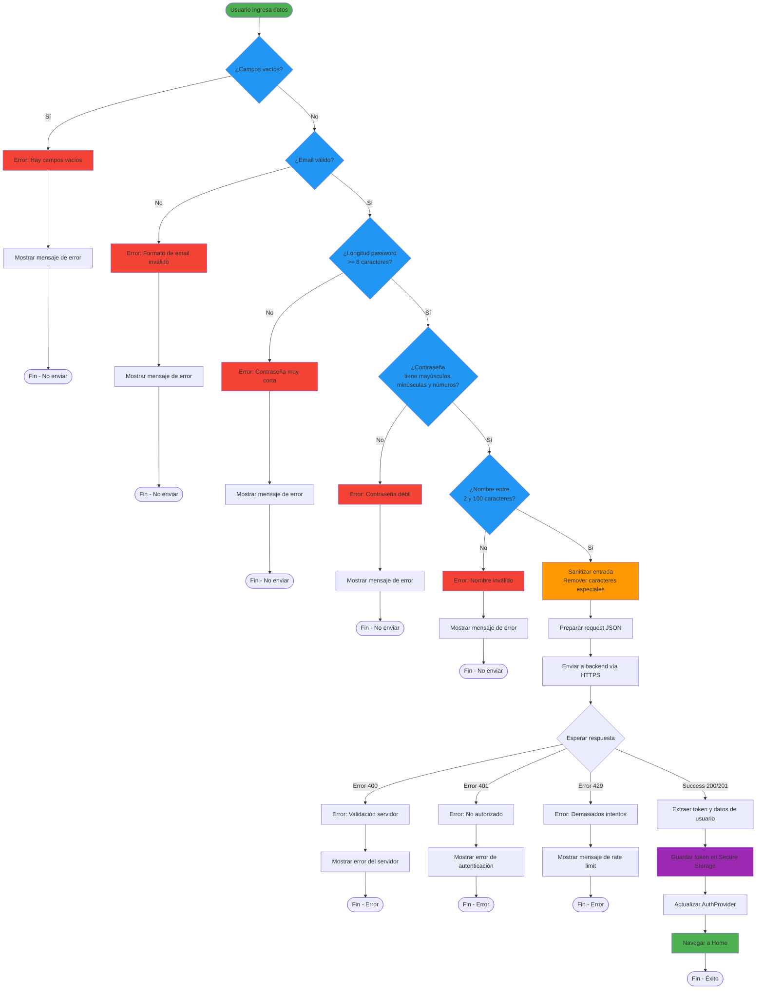

# Diagrama: Flujo de Validación de Entrada en Frontend



## Validaciones Implementadas

### 1. Validación de Campos Vacíos
```dart
if (_name.isEmpty || _email.isEmpty || _password.isEmpty) {
  _message = "Hay campos vacios";
  return false;
}
```

### 2. Validación de Email
```dart
bool _isValidEmail(String email) {
  final emailRegex = RegExp(
    r'^[a-zA-Z0-9._%+-]+@[a-zA-Z0-9.-]+\.[a-zA-Z]{2,}$'
  );
  return emailRegex.hasMatch(email);
}
```
**Criterios**:
- Formato válido según RFC 5322
- No caracteres especiales peligrosos
- Dominio válido

### 3. Validación de Longitud de Contraseña
```dart
if (_password.length < 8) {
  _message = "La contrasena debe tener al menos 8 caracteres";
  return false;
}
```

### 4. Validación de Complejidad de Contraseña
```dart
bool _isStrongPassword(String password) {
  final hasUppercase = password.contains(RegExp(r'[A-Z]'));
  final hasLowercase = password.contains(RegExp(r'[a-z]'));
  final hasDigits = password.contains(RegExp(r'[0-9]'));
  return hasUppercase && hasLowercase && hasDigits;
}
```
**Criterios**:
- Al menos una mayúscula
- Al menos una minúscula
- Al menos un número

### 5. Sanitización de Entrada (Chatbot)
```dart
String _sanitizeInput(String input) {
  return input
    .replaceAll('<', '&lt;')
    .replaceAll('>', '&gt;')
    .replaceAll('"', '&quot;')
    .replaceAll("'", '&#x27;')
    .replaceAll('/', '&#x2F;');
}
```

## Mensajes de Error UX

| Error | Mensaje | Acción |
|-------|---------|--------|
| Campos vacíos | "Hay campos vacíos" | Resaltar campos |
| Email inválido | "Formato de email inválido" | Focus en email |
| Contraseña corta | "La contraseña debe tener al menos 8 caracteres" | Focus en password |
| Contraseña débil | "La contraseña debe contener mayúsculas, minúsculas y números" | Mostrar requisitos |
| Nombre inválido | "El nombre debe tener entre 2 y 100 caracteres" | Focus en nombre |
| Error servidor | Mensaje del servidor | Mostrar error específico |

## Prevención de Ataques

✅ **Protecciones implementadas**:
- XSS: Sanitización de caracteres HTML
- Injection: Validación de formato antes de enviar
- Brute Force: Rate limiting en backend
- Timing Attacks: Mensajes de error genéricos
