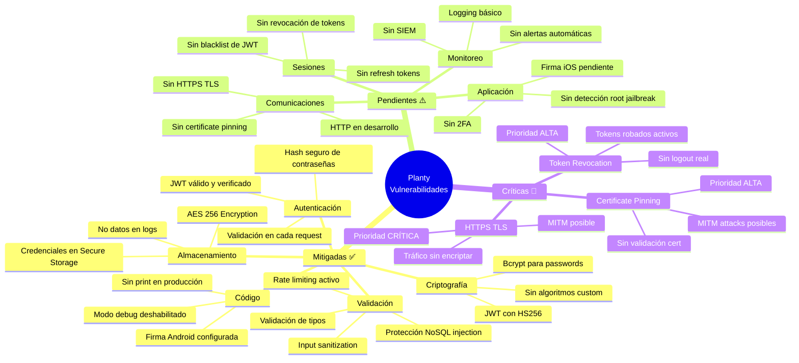
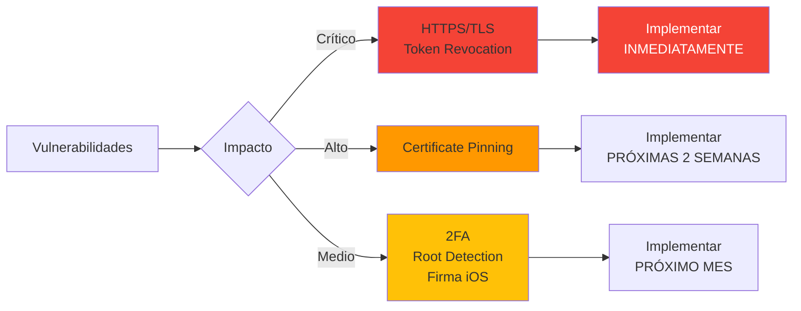

# Diagrama: Mapa de Vulnerabilidades Mitigadas y Pendientes



## Vulnerabilidades Mitigadas (Estado Actual)

### 1. Almacenamiento Inseguro ✅
**MITIGADO - 100%**

- **Problema**: Credenciales en texto plano
- **Solución**: Flutter Secure Storage con AES-256
- **Ubicación**: `lib/features/auth/data/datasource/storage_service.dart`
- **Evidencia**:
  ```dart
  final _storage = FlutterSecureStorage();
  await _storage.write(key: 'auth_token', value: token);
  ```

### 2. Contraseñas en Texto Plano ✅
**MITIGADO - 100%**

- **Problema**: Passwords sin hash en base de datos
- **Solución**: Bcrypt con salt rounds = 10
- **Ubicación**: `authentication/src/infrastructure/services/BcryptService.ts`
- **Evidencia**:
  ```typescript
  const hash = await bcrypt.hash(plainText, 10);
  ```

### 3. Tokens sin Firma ✅
**MITIGADO - 100%**

- **Problema**: Tokens JWT sin verificación
- **Solución**: HMAC-SHA256 con secret key
- **Ubicación**: `authentication/src/infrastructure/services/JwtService.ts`
- **Evidencia**:
  ```typescript
  jwt.sign(payload, secret, { algorithm: 'HS256' });
  ```

### 4. Inyección NoSQL ✅
**MITIGADO - 100%**

- **Problema**: Queries con input sin sanitizar
- **Solución**: Sanitización + validación de tipos + Mongoose ORM
- **Ubicación**: `api-users/src/infrastructure/repositories/`
- **Evidencia**:
  ```typescript
  input.replace(/[$]/g, '').replace(/[{}]/g, '');
  ```

### 5. Sin Rate Limiting ✅
**MITIGADO - 100%**

- **Problema**: Ataques de fuerza bruta sin limitación
- **Solución**: express-rate-limit por endpoint
- **Ubicación**: `api-gateway/src/middleware/rateLimiters.ts`
- **Evidencia**:
  ```typescript
  authLimiter: 5 req / 15 min
  chatLimiter: 30 req / 15 min
  ```

### 6. Logs con Datos Sensibles ✅
**MITIGADO - 100%**

- **Problema**: Passwords y tokens en logs
- **Solución**: Sanitización de logs + kReleaseMode check
- **Ubicación**: `lib/main.dart`, controllers
- **Evidencia**:
  ```dart
  if (kReleaseMode) {
    debugPrint = (String? message, {int? wrapWidth}) {};
  }
  ```

## Vulnerabilidades Pendientes

### 1. Sin HTTPS/TLS 🔴
**CRÍTICA - 0% Implementado**

**Riesgo**:
- Intercepción de tráfico (Man-in-the-Middle)
- Exposición de tokens JWT
- Robo de credenciales

**Impacto**: CRÍTICO
**Probabilidad**: ALTA en redes públicas

**Plan de mitigación**:
```bash
# 1. Obtener certificado (1 día)
sudo certbot certonly --standalone -d api.planty.com

# 2. Configurar Nginx (1 día)
server {
  listen 443 ssl http2;
  ssl_certificate /etc/letsencrypt/live/api.planty.com/fullchain.pem;
  ssl_certificate_key /etc/letsencrypt/live/api.planty.com/privkey.pem;
  ssl_protocols TLSv1.2 TLSv1.3;
}

# 3. Forzar HTTPS (Flutter)
const apiUrl = 'https://api.planty.com/api';
```

**Estimación**: 2-3 días

---

### 2. Sin Revocación de Tokens 🔴
**ALTA - 0% Implementado**

**Riesgo**:
- Tokens robados permanecen activos 24 horas
- No hay logout real
- Sesiones comprometidas no revocables

**Impacto**: ALTO
**Probabilidad**: MEDIA

**Plan de mitigación**:
```typescript
// 1. Redis blacklist (1 día)
import Redis from 'ioredis';
const redis = new Redis();

async function revokeToken(token: string) {
  const decoded = jwt.decode(token);
  const ttl = decoded.exp - Math.floor(Date.now() / 1000);
  await redis.setex(`revoked:${token}`, ttl, '1');
}

// 2. Middleware de verificación (1 día)
async function checkRevoked(token: string): Promise<boolean> {
  const exists = await redis.exists(`revoked:${token}`);
  return exists === 1;
}

// 3. Endpoint de logout (1 día)
app.post('/auth/logout', validateToken, async (req, res) => {
  await revokeToken(req.token);
  res.json({ message: 'Logout exitoso' });
});
```

**Estimación**: 3 días

---

### 3. Sin Certificate Pinning 🟡
**ALTA - 0% Implementado**

**Riesgo**:
- MITM con certificados falsos
- Bypass de HTTPS con proxy malicioso

**Impacto**: ALTO
**Probabilidad**: BAJA (requiere control de red)

**Plan de mitigación**:
```dart
// Flutter certificate pinning
import 'package:flutter/services.dart';

class HttpClient {
  HttpClient() {
    final cert = await rootBundle.load('assets/cert.pem');
    SecurityContext context = SecurityContext()
      ..setTrustedCertificatesBytes(cert.buffer.asUint8List());

    HttpClient httpClient = HttpClient(context: context);
  }
}
```

**Estimación**: 2 días

---

### 4. Sin Detección de Root/Jailbreak 🟡
**MEDIA - 0% Implementado**

**Riesgo**:
- Bypass de seguridad del dispositivo
- Acceso directo a Secure Storage
- Debugging de la app

**Impacto**: MEDIO
**Probabilidad**: BAJA

**Plan de mitigación**:
```dart
// Usar flutter_jailbreak_detection
import 'package:flutter_jailbreak_detection/flutter_jailbreak_detection.dart';

Future<void> checkDeviceSecurity() async {
  final isJailbroken = await FlutterJailbreakDetection.jailbroken;
  if (isJailbroken) {
    // Mostrar warning o bloquear funcionalidad sensible
    showSecurityWarning();
  }
}
```

**Estimación**: 1 día

---

### 5. Sin Autenticación 2FA 🟡
**MEDIA - 0% Implementado**

**Riesgo**:
- Cuenta comprometida con solo password
- Phishing exitoso

**Impacto**: MEDIO
**Probabilidad**: BAJA

**Plan de mitigación**:
```typescript
// Implementar TOTP (Time-based One-Time Password)
import * as speakeasy from 'speakeasy';

// Generar secret para usuario
const secret = speakeasy.generateSecret();
await user.update({ totpSecret: secret.base32 });

// Verificar código
const verified = speakeasy.totp.verify({
  secret: user.totpSecret,
  encoding: 'base32',
  token: userCode
});
```

**Estimación**: 5 días

---

### 6. Firma iOS Incompleta 🟡
**MEDIA - 50% Implementado**

**Riesgo**:
- No se puede publicar en App Store
- Builds no firmados

**Impacto**: MEDIO (solo deployment)
**Probabilidad**: ALTA (al publicar)

**Plan de mitigación**:
```bash
# 1. Obtener certificado de Apple Developer
# 2. Configurar perfil de aprovisionamiento
# 3. Configurar en Xcode
```

**Estimación**: 2 días

---

## Priorización de Vulnerabilidades



## Roadmap de Implementación

| Semana | Tarea | Vulnerabilidad | Esfuerzo |
|--------|-------|----------------|----------|
| 1 | Configurar HTTPS/TLS | Sin encriptación | 2-3 días |
| 2 | Implementar revocación JWT | Tokens sin logout | 3 días |
| 3 | Certificate pinning | MITM | 2 días |
| 4 | Detección root/jailbreak | Bypass seguridad | 1 día |
| 5-6 | Autenticación 2FA | Phishing | 5 días |
| 7 | Firma iOS | Deployment | 2 días |

## Métricas de Seguridad

| Categoría | Implementado | Pendiente | % Completado |
|-----------|--------------|-----------|--------------|
| Almacenamiento | 2/2 | 0/2 | 100% |
| Criptografía | 2/2 | 0/2 | 100% |
| Autenticación | 3/5 | 2/5 | 60% |
| Red | 0/2 | 2/2 | 0% |
| Código | 2/3 | 1/3 | 67% |
| **TOTAL** | **9/14** | **5/14** | **64%** |
