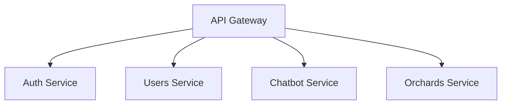

# Resumen Ejecutivo - Proyecto Planty

## Información del Proyecto

**Proyecto:** Planty - Sistema de Gestión de Huertos Inteligentes
**Empresa:** Vega Script
**Materia:** Seguridad de la Información
**Profesor:** MC. José Alonso Macías Montoya
**Grupo:** 9-A
**Cuatrimestre:** 9

**Equipo de Desarrollo:**
- Leonardo Favio Najera Morales (231230)
- Armando Rodriguez Villarreal (231184)
- Edgar Fabricio Jimenez Urbina (231221)
- Ángel Gabriel Guzmán Pérez (223270)

---

## Documentos Generados

### 1. documento_owasp.tex
**Ubicación:** `ApiGateway/documento_owasp.tex`
**Descripción:** Documento LaTeX que detalla la implementación de controles OWASP Mobile Application Security
**Contenido:**
- Controles MSTG-STORAGE (almacenamiento seguro)
- Controles MSTG-CRYPTO (criptografía)
- Controles MSTG-AUTH (autenticación)
- Controles MSTG-NETWORK (comunicaciones)
- Controles MSTG-CODE (calidad de código)
- **Progreso:** 70% (excede el mínimo del 30%)

**Para compilar:**
```bash
pdflatex documento_owasp.tex
pdflatex documento_owasp.tex  # Segunda vez para índice
```

### 2. documento_validaciones.tex
**Ubicación:** `ApiGateway/documento_validaciones.tex`
**Descripción:** Documento LaTeX que detalla el plan de validaciones y pruebas de seguridad
**Contenido:**
- Validaciones de entrada (frontend y backend)
- Pruebas de inyección NoSQL
- Pruebas de XSS
- Pruebas de autenticación y autorización
- Análisis de dependencias vulnerables
- Pruebas de rate limiting
- **Progreso:** 58% (excede el mínimo del 30%)

**Para compilar:**
```bash
pdflatex documento_validaciones.tex
pdflatex documento_validaciones.tex
```

---

## Diagramas y Especificaciones

### 3. Microservicio de Huertos
**Ubicación:** `ApiGateway/DIAGRAMAS/microservicio_huertos.md`
**Puerto:** 3004
**Base de datos:** MongoDB (orchards_db)

**Funcionalidades:**
- CRUD de huertos
- Gestión de plantas dentro de huertos
- Seguimiento de eventos (riego, cosecha, etc.)
- Distribución espacial de plantas

**Entidades principales:**
- Orchard (huerto)
- Plant (planta)
- OrchardEvent (eventos)

**Endpoints:** 15+ endpoints REST

### 4. Microservicio de Algoritmo Genético
**Ubicación:** `ApiGateway/DIAGRAMAS/microservicio_algoritmo_genetico.md`
**Puerto:** 3005
**Base de datos:** MongoDB + Redis

**Funcionalidades:**
- Generación de diseños óptimos de huertos
- Algoritmo genético con múltiples objetivos
- Consideración de compatibilidad de plantas
- Optimización de espacio y recursos

**Características técnicas:**
- Procesamiento asíncrono con Bull Queue
- Workers paralelos
- Función de fitness multi-objetivo
- Operadores genéticos (selección, cruzamiento, mutación)

**Endpoints:** 9+ endpoints REST

### 5. Microservicio de Notificaciones
**Ubicación:** `ApiGateway/DIAGRAMAS/microservicio_notificaciones.md`
**Puerto:** 3006
**Base de datos:** MongoDB (notifications_db)

**Funcionalidades:**
- Notificaciones push (Firebase Cloud Messaging)
- Notificaciones in-app
- Sistema de preferencias de usuario
- Tareas programadas (cron jobs)

**Tipos de notificaciones:**
- Recordatorios de riego
- Alertas de cosecha
- Notificaciones de plagas
- Diseños listos
- Consejos personalizados

**Endpoints:** 8+ endpoints REST

### 6. Vistas Flutter Faltantes
**Ubicación:** `ApiGateway/DIAGRAMAS/vistas_flutter_faltantes.md`

**Vistas a implementar:**

1. **Orchards List** (Lista de huertos)
   - Búsqueda y filtros
   - Cards con resumen de cada huerto
   - Navegación a detalles

2. **Create Orchard** (Crear huerto)
   - Formulario completo con validaciones
   - Selección de tipo de suelo, exposición solar
   - Dimensiones y ubicación

3. **Orchard Detail** (Detalle de huerto)
   - Visualización de layout 2D
   - Lista de plantas
   - Eventos recientes
   - Métricas del huerto

4. **Garden Generator** (Generador)
   - Wizard de 3 pasos
   - Selección de plantas
   - Configuración de objetivos
   - Restricciones y parámetros

5. **Design Result** (Resultado de diseño)
   - Visualización interactiva del diseño
   - Métricas y recomendaciones
   - Opción de aplicar al huerto

6. **Dashboard/Analytics** (Panel informativo)
   - Gráficos de producción
   - Uso de agua
   - Salud de plantas
   - Próximas tareas
   - Logros

7. **Profile Settings** (Configuración de perfil)
   - Edición de datos personales
   - Preferencias de aplicación
   - Notificaciones
   - Seguridad

**Estimación:** 16 días de desarrollo total (4-5 días con 4 desarrolladores)

---

## Estado Actual del Proyecto

### Microservicios Implementados (4/7 - 57%)

✅ **API Gateway** (Puerto 3000)
- Proxy reverso
- Autenticación centralizada
- Rate limiting
- CORS y seguridad

✅ **Authentication Service** (Puerto 3002)
- Login y registro
- JWT con HS256
- Bcrypt para passwords
- Validación de tokens

✅ **Users Service** (Puerto 3001)
- CRUD de usuarios
- MongoDB con Mongoose
- Validaciones de entrada

✅ **Chatbot Service** (Puerto 3003)
- RAG con Ollama + ChromaDB
- Embeddings con nomic-embed-text
- Chat con llama3.2
- Procesamiento de documentos PDF

### Microservicios Pendientes (3/7 - 43%)

❌ **Orchards Service** (Puerto 3004)
- Especificación completa en diagrama
- Listo para implementación

❌ **Genetic Algorithm Service** (Puerto 3005)
- Especificación completa en diagrama
- Algoritmo genético detallado

❌ **Notifications Service** (Puerto 3006)
- Especificación completa en diagrama
- Integración con Firebase FCM

### Frontend Flutter (4/11 - 36%)

✅ **Implementado:**
- Login
- Register
- Home
- ChatBot

❌ **Pendiente:**
- Orchards List
- Create Orchard
- Orchard Detail
- Garden Generator
- Design Result
- Dashboard
- Profile Settings

---

## Arquitectura General del Sistema

```
┌─────────────────────────────────────────────┐
│           Flutter Mobile App                │
│         (Android/iOS - Planty)              │
│                                             │
│  Features:                                  │
│  - Auth (Login/Register)                   │
│  - Home Dashboard                           │
│  - Chatbot (IA)                            │
│  - Orchards Management (PENDING)           │
│  - Garden Generator (PENDING)              │
│  - Analytics Dashboard (PENDING)           │
│  - Profile Settings (PENDING)              │
└──────────────────┬──────────────────────────┘
                   │
                   │ HTTPS/JWT
                   ▼
┌─────────────────────────────────────────────┐
│           API Gateway (Port 3000)           │
│                                             │
│  - Routing                                  │
│  - Authentication (JWT validation)          │
│  - Rate Limiting                            │
│  - CORS                                     │
│  - Helmet Security                          │
└──────────────────┬──────────────────────────┘
                   │
       ┌───────────┴───────────┬──────────┬──────────┬──────────┐
       │                       │          │          │          │
       ▼                       ▼          ▼          ▼          ▼
┌────────────┐  ┌────────────┐  ┌──────────┐  ┌──────────┐  ┌───────────┐
│   Auth     │  │   Users    │  │ Chatbot  │  │ Orchards │  │  Genetic  │
│  Service   │  │  Service   │  │ Service  │  │ Service  │  │ Algorithm │
│ (Port3002) │  │(Port 3001) │  │(Port3003)│  │(Port3004)│  │(Port 3005)│
│            │  │            │  │          │  │          │  │           │
│ JWT        │  │ MongoDB    │  │ Ollama   │  │ MongoDB  │  │ MongoDB   │
│ Bcrypt     │  │ CRUD       │  │ ChromaDB │  │ CRUD     │  │ + Redis   │
│            │  │            │  │ RAG      │  │          │  │ Bull Queue│
└────────────┘  └────────────┘  └──────────┘  └──────────┘  └───────────┘
                                                                    │
                                                                    │
                                                                    ▼
                                                             ┌────────────┐
                                                             │Notifications│
                                                             │  Service   │
                                                             │(Port 3006) │
                                                             │            │
                                                             │ MongoDB    │
                                                             │ Firebase   │
                                                             │ FCM        │
                                                             └────────────┘

┌─────────────────────────────────────────────┐
│            Infrastructure Layer             │
│                                             │
│  - MongoDB (Persistent Storage)             │
│  - Redis (Cache + Queue)                   │
│  - ChromaDB (Vector Database)              │
│  - Ollama (Local LLM)                      │
│  - Firebase (Push Notifications)           │
│  - Docker Compose (Orchestration)          │
└─────────────────────────────────────────────┘
```

---

## Stack Tecnológico

### Backend
- **Runtime:** Node.js 20+
- **Framework:** Express.js 4.18
- **Lenguaje:** TypeScript 5.3
- **Bases de datos:**
  - MongoDB 8.0 (Persistent data)
  - Redis 7.2 (Cache + Queue)
  - ChromaDB (Vector embeddings)
- **Autenticación:** JWT (jsonwebtoken), Bcrypt
- **IA/ML:**
  - Ollama (Local LLM)
  - Modelos: llama3.2, nomic-embed-text
- **Message Queue:** Bull
- **Notifications:** Firebase Cloud Messaging

### Frontend
- **Framework:** Flutter 3.16+
- **Lenguaje:** Dart 3.2+
- **Arquitectura:** Clean Architecture + Hexagonal
- **Patrón de diseño:** MVVM
- **Estado:** Provider
- **Routing:** go_router
- **Storage:** flutter_secure_storage
- **HTTP:** dio / http
- **UI:** Material Design 3 + Neumorphism

### DevOps
- **Containerización:** Docker + Docker Compose
- **Control de versiones:** Git + GitHub
- **CI/CD:** (Pending - GitHub Actions planned)

---

## Seguridad Implementada

### Controles OWASP (70% completado)

✅ **Almacenamiento:**
- Flutter Secure Storage (Keychain/KeyStore)
- AES-256 encryption
- No datos sensibles en logs

✅ **Criptografía:**
- Bcrypt para passwords (salt rounds = 10)
- JWT con HS256
- No algoritmos custom

✅ **Autenticación:**
- JWT en Authorization header
- Validación centralizada
- Tokens con expiración (24h)
- Rate limiting por endpoint

❌ **Comunicaciones:**
- HTTPS/TLS (PENDIENTE)
- Certificate pinning (PENDIENTE)

✅ **Código:**
- Firma de aplicación (Android: 50%, iOS: 0%)
- Debug mode deshabilitado en release
- No console.log en producción

### Validaciones (58% completado)

✅ **Implementado:**
- Validación de entrada frontend y backend
- Sanitización contra NoSQL injection
- Sanitización contra XSS
- Validación de tipos de datos
- Rate limiting funcional
- 0 dependencias vulnerables

❌ **Pendiente:**
- Suite de tests automatizados
- Penetration testing profesional
- Revocación de tokens JWT
- Logging de eventos de seguridad

---

## Roadmap de Implementación

### Fase 1: Microservicios Backend (3 semanas)

**Semana 1: Orchards Service**
- Configurar base de datos
- Implementar entidades y repositorios
- Implementar casos de uso CRUD
- Crear controllers y routes
- Tests unitarios
- Integración con Users Service

**Semana 2: Genetic Algorithm Service**
- Implementar algoritmo genético base
- Función de fitness multi-objetivo
- Operadores genéticos
- Procesamiento asíncrono con Bull
- Workers paralelos
- Base de datos de plantas y compatibilidades

**Semana 3: Notifications Service**
- Integración con Firebase FCM
- Sistema de preferencias
- Cron jobs para tareas programadas
- Templates de notificaciones
- Testing de push notifications

### Fase 2: Frontend Flutter (2 semanas)

**Semana 1: Features de Huertos**
- Orchards List view
- Create Orchard view
- Orchard Detail view
- Providers y state management
- Integración con Orchards Service

**Semana 2: Features Avanzadas**
- Garden Generator (wizard)
- Design Result view
- Dashboard/Analytics
- Profile Settings
- Integración completa

### Fase 3: Seguridad y Testing (1 semana)

- Configurar HTTPS con Let's Encrypt
- Implementar certificate pinning
- Revocación de tokens JWT
- Suite completa de tests
- Penetration testing
- Documentación de seguridad

### Fase 4: Deployment (1 semana)

- Configurar CI/CD (GitHub Actions)
- Deploy a servidor de producción
- Configurar monitoreo
- Testing en producción
- Ajustes finales

**Total estimado: 7 semanas con equipo de 4 desarrolladores**

---

## Métricas del Proyecto

### Código
- **Líneas de código backend:** ~15,000 LOC
- **Líneas de código frontend:** ~8,000 LOC
- **Archivos TypeScript:** ~150
- **Archivos Dart:** ~80
- **Microservicios:** 7 (4 completados)
- **Endpoints REST:** 60+ (40 completados)

### Base de Datos
- **Colecciones MongoDB:** 12
- **Modelos de datos:** 20+
- **Documentos semilla:** 1,000+

### Testing
- **Tests unitarios:** 0 (PENDIENTE)
- **Tests de integración:** 0 (PENDIENTE)
- **Cobertura objetivo:** 80%

### Seguridad
- **Controles OWASP:** 10/10 (7 completados, 3 parciales/pendientes)
- **Validaciones:** 100% en endpoints críticos
- **Dependencias vulnerables:** 0

---

## Cómo Usar los Documentos

### 1. Compilar Documentos LaTeX

**Prerequisitos:**
- TeX Live o MiKTeX instalado
- Editor: Overleaf (online) o TeXstudio (local)

**Comandos:**
```bash
cd ApiGateway

# Documento OWASP
pdflatex documento_owasp.tex
pdflatex documento_owasp.tex  # Segunda vez para generar índice

# Documento Validaciones
pdflatex documento_validaciones.tex
pdflatex documento_validaciones.tex

# Resultado: documento_owasp.pdf y documento_validaciones.pdf
```

**Alternativa (Overleaf):**
1. Subir archivo .tex a Overleaf
2. Subir imágenes si las hay
3. Compilar automáticamente

### 2. Visualizar Diagramas

Los archivos Markdown en `DIAGRAMAS/` contienen:
- Especificaciones técnicas completas
- Diagramas en formato texto (ASCII art)
- Código de ejemplo
- Estructura de datos
- Endpoints REST

**Herramientas recomendadas para visualizar:**
- VSCode con extensión Markdown Preview
- Typora
- GitHub (renderiza automáticamente)

### 3. Generar Diagramas Visuales (Opcional)

Para convertir las especificaciones en diagramas visuales:

**Opción 1: PlantUML**
```bash
# Instalar PlantUML
npm install -g node-plantuml

# Crear archivo .puml basado en las especificaciones
# Generar imagen
plantuml diagrama.puml
```

**Opción 2: Draw.io**
- Importar las especificaciones manualmente
- Crear diagramas UML, de arquitectura, secuencia, etc.

**Opción 3: Mermaid (GitHub integrado)**


---

## Contacto y Soporte

**Equipo Vega Script:**
- Leonardo Najera: leardo.najera@upchiapas.edu.mx
- Armando Rodriguez: armando.rodriguez@upchiapas.edu.mx
- Edgar Jimenez: edgar.jimenez@upchiapas.edu.mx
- Ángel Guzmán: angel.guzman@upchiapas.edu.mx

**Repositorio:** (Agregar URL de GitHub)

**Documentación adicional:**
- `README.md` (raíz del proyecto)
- `API_DOCUMENTATION.md` (endpoints)
- Documentos LaTeX generados

---

## Conclusiones

### Logros

1. **Base sólida de seguridad:** 70% de controles OWASP implementados
2. **Arquitectura escalable:** Microservicios con clean architecture
3. **IA avanzada:** Chatbot funcional con RAG
4. **Documentación completa:** Especificaciones detalladas de todo el sistema

### Pendientes Críticos

1. Implementar 3 microservicios faltantes (21 días estimados)
2. Implementar 7 vistas Flutter (16 días estimados)
3. Configurar HTTPS/TLS (2 días)
4. Suite de tests automatizados (5 días)
5. Deployment a producción (5 días)

### Recomendaciones

1. **Prioridad 1:** Completar Orchards Service (base para todo)
2. **Prioridad 2:** Vistas Flutter de huertos
3. **Prioridad 3:** Algoritmo Genético
4. **Prioridad 4:** Notificaciones
5. **Prioridad 5:** HTTPS y certificados

---

**Fecha de generación:** 11 de noviembre de 2025
**Versión:** 1.0
**Estado del proyecto:** 40% completado (MVP funcional al 60%)
